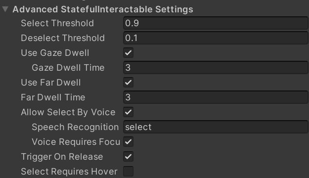

# Documentation of an MRTK3 project with Unity
This document has the purpose of presenting the challenges that arose in the process of migrating a project from MRTK2 to MRTK3 and including eye-tracking in it. 

## Requirements  

## Migration

not started

## Eye-tracking

The goal of this section is to present the process of adding eyes-tracking into an MRTK3 project.

### Creation of a simple application with eye-tracking

 **NOTE:** take inspiration from the fundamental of MRTK tutos from Microsoft for the re-redaction of this !!! .

1. Create a simple scene in Unity (delete main camera, add MRTK XR Rig and MRTK Input Simulator)
2. Add a 3D Object cube to the hierarchy, name it `cube`
3. Add component `StatefulInteractable` to `cube`
4. Set the 

#### Tutorial inspirations :
- [Enable eye tracking and voice commands for objects on the HoloLens 2](https://learn.microsoft.com/en-us/training/modules/use-eye-tracking-voice-commands/6-3-exercise-eye-tracking)
- [MRTK3 StatefulInteractable gaze, hover and select events - and how to use them ](https://localjoost.github.io/MRTK3-StatefulInteractable-gaze,-hover-and-select-events-and-how-to-use-them/)

### Adding eyes-tracking into the project
